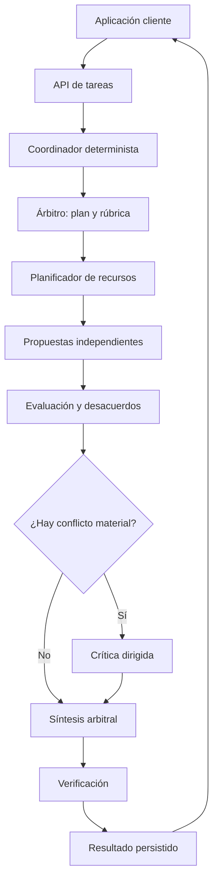

# Diseño de consenso multi-LLM para AI Broker

Fecha: 23 de junio de 2026

## 1. Conclusión ejecutiva

AI Broker puede incorporar un modo de consenso sin romper su arquitectura actual. La solución recomendada no consiste en que un LLM controle directamente la cola ni llame libremente a otros modelos, sino en separar dos responsabilidades:

- **Coordinador determinista (código Python):** valida la petición, selecciona modelos de una lista autorizada, crea las invocaciones, aplica límites de coste y tiempo, persiste cada etapa, reintenta y cancela.
- **Árbitro semántico (LLM):** analiza el trabajo, propone el plan y la rúbrica, evalúa las respuestas ya generadas y redacta una respuesta final que conserva los mejores elementos y explicita desacuerdos relevantes.

El patrón recomendado para el MVP es:

1. Planificación y rúbrica.
2. Tres respuestas independientes de modelos diversos.
3. Evaluación anónima y estructurada.
4. Crítica dirigida solo cuando exista desacuerdo material.
5. Síntesis final por el árbitro.
6. Verificación determinista o mediante herramientas cuando la tarea lo permita.

Esto es más fiable que concatenar respuestas, votar texto libre o permitir una conversación ilimitada entre agentes. El consenso debe ser un **proceso acotado y auditable**, no un chat colectivo sin final.

## 2. Qué permite ya el proyecto adjunto

El ZIP contiene especificaciones y documentación, no una implementación Python completa. El diseño actual ya aporta piezas útiles:

- FastAPI y API asíncrona con `202 Accepted`.
- SQLite en modo WAL y recuperación de tareas.
- Estados persistidos y cancelación idempotente.
- Proveedores Ollama y DeepSeek.
- Autodescubrimiento de modelos.
- Presupuesto, coste máximo y modelo preferido.
- Un único slot global protegido por `asyncio.Semaphore(1)` y lease de VRAM.
- Chunking y síntesis secuenciales.

La restricción `max_active_llm_tasks: 1` mezcla dos conceptos que deben separarse: el número de trabajos del broker que se procesan simultáneamente y el número de invocaciones internas de una tarea Mixture-of-Agents (MoA). La configuración recomendada pasa a ser:

- **Un workflow activo inicialmente:** evita que dos aplicaciones compitan de forma imprevisible por los recursos.
- **Varias invocaciones internas cuando caben:** el planificador reserva VRAM para los modelos y sus contextos antes de lanzar la capa MoA.
- **Ejecución por oleadas cuando solo cabe un subconjunto:** lanza en paralelo el grupo que cabe, libera o conserva lo necesario y continúa con el siguiente.
- **Ejecución secuencial cuando no existe una combinación segura:** mantiene la compatibilidad con modelos grandes.
- **Cloud en paralelo cuando se autorice:** no consume VRAM local, pero sí cuotas, presupuesto y conexiones del proveedor.

Por tanto, el broker debe elegir dinámicamente entre `parallel`, `waves` y `sequential` para cada capa MoA. El usuario puede forzar un límite más conservador, pero nunca uno que supere la memoria disponible.

## 3. Arquitectura recomendada



### Componentes

| Componente | Responsabilidad | Debe ser LLM |
|---|---|---:|
| API | Contrato, autenticación futura, idempotencia | No |
| Dispatcher | Reclamar tareas y respetar prioridades | No |
| Consensus Coordinator | Ejecutar el grafo acotado y reanudarlo | No |
| Resource Scheduler | Reservar VRAM y decidir paralelo, oleadas o secuencial | No |
| Model Router | Filtrar por capacidad, privacidad, coste y salud | No |
| Planner/Arbiter | Crear rúbrica y plan semántico | Sí |
| Proposers | Resolver de forma independiente | Sí |
| Critics/Judges | Detectar errores y aportaciones únicas | Sí, salvo validadores |
| Synthesizer | Producir la respuesta final | Sí |
| Verifiers | Tests, esquemas, cálculos, citas y reglas | Preferiblemente no |
| Repository | Tareas, etapas, invocaciones y costes | No |

### Por qué el árbitro no debe orquestar directamente

Un LLM no debe decidir por sí solo llamadas HTTP, reintentos o gasto. Puede devolver un plan estructurado, pero el coordinador debe:

- aceptar únicamente modelos y proveedores incluidos en una allowlist;
- imponer máximos de agentes, rondas, tokens, coste y duración;
- impedir bucles y llamadas recursivas;
- validar toda salida con JSON Schema/Pydantic;
- registrar cada decisión y poder reanudar tras un reinicio;
- tratar las respuestas de otros modelos como datos no confiables, no como instrucciones.

### Planificador adaptativo de VRAM

Antes de ejecutar cada capa MoA, el broker construye un plan de recursos. No basta con sumar el tamaño de los ficheros GGUF: también cuentan el KV cache, la longitud de contexto, el número de solicitudes paralelas, buffers del runtime y un margen de seguridad.

```text
vram_reserved =
    sum(unique_model_weights)
  + sum(context_and_kv_cache_per_invocation)
  + runtime_overhead
  + safety_margin
```

Si varias invocaciones usan exactamente el mismo modelo cargado, los pesos se cuentan una vez, pero cada contexto concurrente añade memoria. Si son modelos distintos, se reservan los pesos de todos.

Fuentes para calcularlo:

- `/api/ps`: `size_vram`, `context_length` y modelos actualmente cargados;
- telemetría NVIDIA/AMD del sistema;
- tamaño y cuantización descubiertos por Ollama;
- perfiles medidos por el propio broker después de ejecuciones reales;
- contexto de entrada y salida reservado para cada agente.

Algoritmo recomendado:

1. Restar de los 64 GB la memoria ya ocupada y un margen configurable.
2. Estimar la reserva de cada invocación con datos históricos conservadores.
3. Intentar colocar toda la capa en una única oleada.
4. Si no cabe, aplicar bin packing y formar el menor número de oleadas seguras.
5. Si ningún par cabe, ejecutar secuencialmente.
6. Confirmar la carga real con `/api/ps`; si supera la reserva, no iniciar nuevas invocaciones de esa oleada.
7. Mantener cada modelo con `keep_alive` hasta terminar su oleada o hasta que sea necesario liberar VRAM.

La decisión de paralelismo es del broker, no del LLM árbitro. El árbitro puede solicitar capacidades o diversidad, pero no puede ignorar los límites físicos.

Configuración propuesta:

```yaml
processing:
  max_active_workflows: 1
  max_parallel_invocations: auto

resources:
  local_vram_budget_gb: 64
  vram_safety_margin_gb: 6
  max_loaded_local_models: auto
  scheduling_policy: adaptive
  allow_execution_waves: true

cloud_concurrency:
  default_per_provider: 2
  deepseek: 3
```

`max_active_llm_tasks` debería quedar obsoleto o redefinirse claramente. Los nuevos nombres distinguen workflows, invocaciones y modelos residentes.

## 4. Protocolo de consenso

### Etapa 0: validación y clasificación

El broker valida el contrato y clasifica la tarea por tipo: razonamiento, programación, análisis documental, extracción, redacción, traducción, visión u otro. También determina:

- sensibilidad de los datos;
- si se permite cloud;
- necesidad de herramientas o fuentes externas;
- formato de salida;
- presupuesto y plazo;
- nivel de riesgo.

La clasificación puede empezar con reglas y, cuando sea ambiguo, usar una llamada barata. No conviene gastar un modelo grande en tareas evidentes.

### Etapa 1: plan y rúbrica

El árbitro recibe la petición original y devuelve JSON estructurado:

```json
{
  "task_type": "technical_analysis",
  "required_capabilities": ["reasoning", "code_review"],
  "rubric": [
    {"criterion": "correctness", "weight": 0.40},
    {"criterion": "completeness", "weight": 0.25},
    {"criterion": "evidence", "weight": 0.20},
    {"criterion": "clarity", "weight": 0.15}
  ],
  "proposer_roles": ["generalist", "specialist", "skeptic"],
  "verification": ["schema", "citation_check"],
  "max_rounds": 2
}
```

El coordinador valida este plan y puede reducirlo, pero nunca ampliar los límites solicitados por la aplicación.

### Etapa 2: propuestas independientes

Se envía la misma tarea a tres modelos o configuraciones diferentes. Ninguno ve las respuestas de los demás. Esta independencia es esencial: si ven una respuesta previa demasiado pronto, aparece anclaje y convergencia superficial.

Cada propuesta debe usar un esquema común:

```json
{
  "answer": "...",
  "key_claims": ["..."],
  "assumptions": ["..."],
  "uncertainties": ["..."],
  "evidence": [{"claim": "...", "source": "..."}],
  "confidence": 0.72
}
```

La confianza declarada por el modelo se conserva como señal auxiliar, pero no se toma como probabilidad calibrada.

### Etapa 3: evaluación anónima

Las respuestas se normalizan como `candidate_A`, `candidate_B`, etc. Se eliminan el nombre del modelo y el proveedor para reducir sesgos. El juez recibe el orden aleatorizado y puntúa cada propuesta con la rúbrica.

Para tareas importantes se recomiendan dos evaluaciones con distinto orden. Esto reduce el sesgo de posición. El juez devuelve:

```json
{
  "candidate_scores": [
    {
      "candidate_id": "candidate_A",
      "scores": {
        "correctness": 8,
        "completeness": 7,
        "evidence": 5,
        "clarity": 9
      },
      "fatal_errors": [],
      "unsupported_claims": ["..."],
      "unique_contributions": ["..."]
    }
  ],
  "material_disagreements": ["..."],
  "recommended_candidate": "candidate_A"
}
```

No se deben almacenar cadenas privadas de razonamiento. Se guardan conclusiones, evidencias, errores y justificaciones breves y auditables.

### Etapa 4: crítica dirigida y parada temprana

No toda tarea necesita debate. Se detiene antes de una segunda ronda si:

- las respuestas coinciden en las conclusiones principales;
- no existen errores fatales;
- las verificaciones pasan;
- la puntuación líder supera un umbral y la diferencia es estable al cambiar el orden.

Si hay conflicto, cada crítico recibe únicamente los puntos concretos en disputa. Debe responder a preguntas como: “¿La afirmación X está sustentada?” o “¿Qué solución cumple el requisito Y?”. Una ronda dirigida aporta más que pedir “debate libre”.

### Etapa 5: síntesis arbitral

El árbitro final recibe:

- petición original;
- rúbrica;
- candidatos anónimos;
- evaluaciones;
- desacuerdos;
- resultados de validadores;
- límites exactos de formato.

Debe producir una respuesta nueva, no elegir a ciegas ni concatenar. La salida incluye:

```json
{
  "final_answer": "...",
  "consensus": {
    "level": "high",
    "confidence": 0.84,
    "agreed_points": ["..."],
    "remaining_disagreements": ["..."],
    "warnings": []
  },
  "provenance": {
    "candidate_ids_used": ["candidate_A", "candidate_C"],
    "verification_passed": true
  }
}
```

### Etapa 6: verificación

Cuando exista una prueba objetiva, debe pesar más que la opinión de otro LLM:

- código: compilación, tests, linter y análisis estático;
- matemáticas: calculadora, solver o ejecución controlada;
- datos: consultas reproducibles y comprobaciones de totales;
- JSON/XML: validación contra esquema;
- hechos: recuperación de fuentes, coincidencia cita-afirmación y fecha;
- documentos: cobertura de secciones y trazabilidad al fragmento fuente.

Si una verificación falla, se permite una única reparación dirigida y se vuelve a verificar. Después, la tarea termina con advertencia o error; no entra en un bucle indefinido.

## 5. Cómo elegir los modelos

El consenso mejora por **diversidad útil**, no por contar tres veces el mismo prejuicio. El registro dinámico de modelos debe añadir capacidades aparte de lo que devuelve `/api/tags`:

| Campo | Ejemplo |
|---|---|
| `family` | qwen, llama, deepseek, mistral, gemma |
| `deployment` | local, ollama_cloud, external_api |
| `capabilities` | reasoning, coding, vision, long_context |
| `languages` | es, en |
| `context_window` | 32768 |
| `structured_output` | true |
| `tool_use` | true |
| `quality_tier` | fast, balanced, strong |
| `estimated_vram_gb` | 9.5 |
| `cost_in/out` | precio configurado |
| `trust_zone` | local_private, approved_cloud |
| `benchmark_profile` | resultados internos por tarea |

Reglas propuestas:

1. El árbitro debe ser igual o más capaz que la mediana de los proponentes.
2. Usar al menos dos familias distintas cuando sea posible.
3. Incluir un especialista si el tipo de tarea lo justifica.
4. No enviar datos sensibles a cloud si `cloud_allowed` es falso.
5. Preferir modelos que cumplan JSON Schema para jueces y árbitros.
6. Ajustar los pesos con evaluaciones internas, no solo con reputación general.
7. Evitar que el árbitro juzgue una respuesta identificada como producida por él mismo.

La investigación de modelos Ollama que se está realizando puede alimentar este registro, pero la configuración final debe basarse también en pruebas con las tareas reales del usuario.

### Selección automática, manual e híbrida

La aplicación externa debe poder escoger entre tres políticas:

| Política | Quién elige | Comportamiento ante indisponibilidad |
|---|---|---|
| `auto` | El broker elige proponentes y árbitro | Sustituye dentro de privacidad, coste y calidad |
| `manual` | La aplicación indica todos los modelos | Falla o sustituye según `allow_substitution` |
| `hybrid` | La aplicación fija algunos y el broker completa | Conserva los obligatorios y rellena las plazas libres |

En `auto`, el router combina adecuación a la tarea, diversidad de familias, calidad medida, ventana de contexto, VRAM y coste. También decide cuántos modelos pequeños aportan más valor que uno grande dentro de los 64 GB.

En `manual`, cada referencia debe incluir proveedor, despliegue y nombre exacto. Esto evita confundir un modelo local con uno cloud que tenga un nombre parecido. La aplicación también puede fijar el rol de cada proponente.

En `hybrid`, se pueden imponer, por ejemplo, un modelo especialista en código y el árbitro DeepSeek, dejando al broker seleccionar los otros dos proponentes.

DeepSeek mediante su API puede configurarse inicialmente como **árbitro preferido** por ser el modelo más potente disponible para este despliegue. Conviene expresarlo como política configurable y contrastarlo con evaluaciones internas: “más potente” puede cambiar con el tiempo y también depende de la tarea. Para trabajos concretos, `manual` permite marcarlo como obligatorio y desactivar sustituciones.

## 6. Modos de servicio

| Estrategia/preset | Flujo | Llamadas típicas | Uso recomendado |
|---|---|---:|---|
| `single` | Un modelo | 1 | Tareas simples o baratas |
| `mixture_of_agents/fast` | 3 propuestas + 1 árbitro | 4 | Calidad general con coste moderado |
| `mixture_of_agents/standard` | plan + 3 propuestas + 1 juez + síntesis | 6 | Análisis y decisiones importantes |
| `mixture_of_agents/verified` | standard + validadores + posible reparación | 6-8 | Código, datos, investigación |
| `mixture_of_agents/high_stakes` | 5 propuestas + 2 jueces + síntesis + verificación | 9-11 | Casos críticos, con supervisión humana |

Recomendación para el primer MVP: implementar `single` y `mixture_of_agents` con presets `fast` y `standard`. El preset `verified` se añade por tipo de tarea. `high_stakes` no debe presentarse como sustituto de revisión humana.

## 7. Contrato API compatible

Se conserva `POST /api/v1/tasks`. Los clientes actuales no se rompen porque `execution.strategy` tiene valor predeterminado `single`. El antiguo `execution.mode` puede aceptarse temporalmente como alias durante la migración.

### Ejemplo automático

```json
{
  "request_id": "app-20260623-00042",
  "content": {
    "prompt": "Analiza...",
    "attachments": []
  },
  "output": {
    "format": "markdown",
    "json_schema": null,
    "language": "es"
  },
  "model_requirements": {
    "preferred_model": null,
    "fallback_allowed": true,
    "cloud_allowed": true,
    "allowed_providers": ["ollama", "deepseek"],
    "max_cost_usd": 0.25
  },
  "execution": {
    "strategy": "mixture_of_agents",
    "preset": "standard",
    "scheduling": "adaptive",
    "max_proposers": 3,
    "max_judges": 1,
    "max_rounds": 2,
    "timeout_seconds": 600,
    "early_stop": true,
    "selection": {
      "mode": "auto",
      "diversity_policy": "different_families",
      "arbiter_policy": "strongest_available",
      "preferred_arbiter": {
        "provider": "deepseek",
        "deployment": "api",
        "model": "deepseek-reasoner"
      },
      "allow_substitution": true
    }
  },
  "risk": {
    "data_classification": "internal",
    "human_review_required": false
  }
}
```

El nombre del modelo DeepSeek es ilustrativo y debe resolverse contra el catálogo configurado en el momento de ejecutar.

### Ejemplo manual

```json
{
  "request_id": "app-20260623-00043",
  "content": {
    "prompt": "Revisa la arquitectura y propón una solución",
    "attachments": []
  },
  "model_requirements": {
    "cloud_allowed": true,
    "max_cost_usd": 0.50
  },
  "execution": {
    "strategy": "mixture_of_agents",
    "preset": "standard",
    "scheduling": "adaptive",
    "selection": {
      "mode": "manual",
      "proposers": [
        {
          "provider": "ollama",
          "deployment": "local",
          "model": "qwen-example",
          "role": "generalist"
        },
        {
          "provider": "ollama",
          "deployment": "local",
          "model": "codestral-example",
          "role": "specialist"
        },
        {
          "provider": "ollama",
          "deployment": "cloud",
          "model": "llama-example",
          "role": "skeptic"
        }
      ],
      "arbiter": {
        "provider": "deepseek",
        "deployment": "api",
        "model": "deepseek-reasoner"
      },
      "allow_substitution": false
    }
  }
}
```

### Ejemplo híbrido

```json
{
  "execution": {
    "strategy": "mixture_of_agents",
    "preset": "standard",
    "selection": {
      "mode": "hybrid",
      "proposer_count": 3,
      "required_proposers": [
        {
          "provider": "ollama",
          "deployment": "local",
          "model": "code-specialist-example",
          "role": "specialist"
        }
      ],
      "arbiter": {
        "provider": "deepseek",
        "deployment": "api",
        "model": "deepseek-reasoner",
        "required": true
      },
      "allow_substitution": true
    }
  }
}
```

Respuesta inicial:

```json
{
  "task_id": "task_01J...",
  "status": "queued",
  "execution_strategy": "mixture_of_agents",
  "execution_preset": "standard",
  "selection_mode": "auto",
  "status_url": "/api/v1/tasks/task_01J...",
  "cancel_url": "/api/v1/tasks/task_01J..."
}
```

Respuesta terminal, manteniendo `result_markdown` para compatibilidad:

```json
{
  "task_id": "task_01J...",
  "status": "completed",
  "result_markdown": "...",
  "consensus": {
    "level": "medium",
    "confidence": 0.76,
    "proposers_completed": 3,
    "judges_completed": 1,
    "rounds": 1,
    "remaining_disagreements": []
  },
  "scheduling": {
    "mode_used": "parallel",
    "waves": 1,
    "peak_vram_reserved_gb": 51.4,
    "peak_vram_observed_gb": 49.8
  },
  "usage": {
    "invocations": 6,
    "tokens_input": 18400,
    "tokens_output": 6200,
    "cost_usd": 0.041
  },
  "models_used": [
    {"role": "proposer", "model": "..."},
    {"role": "arbiter", "model": "..."}
  ]
}
```

## 8. Estados y progreso

El estado de tarea debe ampliarse:

```text
queued
  -> routing
  -> planning
  -> resource_planning
  -> proposing
  -> evaluating
  -> debating (opcional)
  -> synthesizing
  -> verifying (opcional)
  -> completed | failed | cancelled
```

El progreso no debe fingir un porcentaje de tokens. Se informa de unidades completadas:

```json
{
  "phase": "proposing",
  "invocations_completed": 1,
  "invocations_total": 3,
  "scheduling_mode": "waves",
  "wave_current": 1,
  "wave_total": 2,
  "active_invocations": [
    {"role": "generalist", "model": "qwen..."},
    {"role": "skeptic", "model": "llama..."}
  ],
  "vram_reserved_gb": 47.2,
  "cost_reserved_usd": 0.08,
  "cost_actual_usd": 0.031
}
```

## 9. Persistencia

Conviene generalizar el concepto de llamada al modelo. Tablas mínimas:

| Tabla | Contenido |
|---|---|
| `tasks` | Contrato original, estado, prioridad y resultado final |
| `consensus_runs` | Estrategia, rúbrica, límites, consenso y versión del algoritmo |
| `stages` | Orden, tipo, estado, dependencias y reintentos |
| `model_invocations` | Rol, modelo, prompt hash, salida, tokens, coste y latencia |
| `candidate_evaluations` | Puntuaciones, errores, aportaciones y orden presentado |
| `verification_results` | Validador, evidencia, resultado y reparación |
| `events` | Historial inmutable para auditoría y dashboard |

Cada etapa debe tener una clave idempotente, por ejemplo `task_id + run_id + stage + role + ordinal`. Tras reiniciar, el coordinador reutiliza invocaciones terminadas y continúa desde la primera etapa incompleta. No debe volver a pagar por una llamada ya confirmada.

### Artefactos Markdown por modelo

Además de SQLite, el broker puede guardar cada resultado en Markdown. Es útil para inspección humana, depuración, comparación y reutilización posterior. SQLite debe seguir siendo la fuente de verdad del estado transaccional; los `.md` son artefactos auditables asociados a las filas mediante ruta, hash y versión.

```text
state/tasks/{task_id}/
  request.md
  plan.md
  manifest.json
  proposers/
    01_generalist_qwen-example.md
    02_specialist_codestral-example.md
    03_skeptic_llama-example.md
  evaluations/
    01_judge.md
    disagreements.md
  synthesis/
    arbiter_deepseek.md
    final.md
  verification/
    results.md
```

Cada fichero de modelo debería contener solo información visible y auditable:

```markdown
# Propuesta 01

- Task ID: task_01J...
- Role: generalist
- Provider: ollama
- Deployment: local
- Model: qwen-example
- Started: 2026-06-23T10:01:14Z
- Finished: 2026-06-23T10:02:09Z
- Input tokens: 4200
- Output tokens: 1350

## Respuesta

...

## Afirmaciones, supuestos e incertidumbres

...
```

No se guardan cadenas privadas de razonamiento. La escritura debe ser atómica: fichero temporal, `fsync` cuando proceda y renombrado final. Después se registra en SQLite el `sha256`, tamaño, tipo y ruta. Si la política de datos prohíbe conservar contenido, se guarda únicamente metadato y hash.

El `manifest.json` relaciona candidatos anónimos con los modelos reales. Esa relación no se entrega al juez durante la evaluación, pero queda disponible para auditoría cuando termina la tarea.

Los prompts completos pueden contener datos sensibles. Debe poder configurarse:

- cifrado en reposo o almacenamiento solo del hash;
- retención por tipo de datos;
- redacción de secretos y datos personales;
- separación entre trazas operativas y contenido.

## 10. Puntuación y confianza

Para cada candidato `i`, con jueces `j` y criterios `k`:

```text
utility_i = sum_k(weight_k * median_j(score_i,j,k))
            - fatal_error_penalty
            - unsupported_claim_penalty
```

Para tareas abiertas es preferible usar mediana de puntuaciones y comparación por pares antes que mayoría textual. Para respuestas cerradas se puede normalizar el resultado y usar mayoría, siempre que un verificador objetivo no la contradiga.

La confianza de consenso puede combinar:

```text
consensus_confidence =
    0.40 * agreement
  + 0.35 * evaluation_stability
  + 0.25 * verification_coverage
```

Reglas de seguridad:

- limitar la confianza máxima si no hubo verificación externa;
- reducirla si todos los modelos son de la misma familia;
- reducirla si el juez cambia de ganador al invertir el orden;
- no ocultar desacuerdos materiales bajo una cifra alta;
- nunca interpretar “3 modelos coinciden” como prueba factual.

Los pesos deben calibrarse con un conjunto de evaluación propio.

## 11. Presupuesto y latencia

Antes de iniciar se reserva el peor coste permitido para todas las llamadas planificadas. La reserva se libera a medida que finalizan o se omiten etapas.

```text
estimated_total = plan
                + sum(proposals)
                + sum(evaluations)
                + optional_debate
                + synthesis
                + repair_margin
```

Política recomendada cuando no cabe en presupuesto:

1. eliminar la ronda de crítica;
2. reducir de tres proponentes a dos solo si el modo lo permite;
3. usar un juez más económico que cumpla el umbral interno;
4. degradar a `single` únicamente si `fallback_allowed` y `consensus_required` no lo impiden;
5. si el consenso es obligatorio, fallar con `CONSENSUS_BUDGET_EXCEEDED`.

Con planificación adaptativa, la latencia de cada capa se aproxima a la suma de las duraciones máximas de sus oleadas, no necesariamente a la suma de todas las invocaciones:

```text
layer_latency = sum(max(invocation_duration_in_wave))
```

Mantener los modelos de una oleada cargados reduce tiempo, pero debe respetar las reservas y leases de VRAM. No conviene forzar `keep_alive: 0` después de cada llamada interna; la descarga se realiza al terminar el uso previsto del modelo o antes de cargar una combinación que no cabe.

## 12. Fallos y recuperación

| Situación | Comportamiento |
|---|---|
| Un proponente falla | Reintento acotado; sustituir si queda quórum y presupuesto |
| No hay quórum mínimo | `CONSENSUS_QUORUM_NOT_REACHED` |
| Árbitro falla | Reintentar; usar árbitro suplente autorizado |
| JSON inválido | Reparación estructural una vez; después fallo tipado |
| Presupuesto agotado | Parada antes de nueva invocación; no sobregastar |
| Cancelación | Cancelar llamada activa y marcar etapas pendientes |
| Reinicio | Reanudar desde la primera etapa no confirmada |
| Modelo local no se descarga | Broker degradado y bloqueo de cargas inseguras |
| Reserva de VRAM insuficiente | Replanificar en más oleadas o secuencialmente |
| Uso real supera la reserva | No iniciar más invocaciones y degradar el perfil del modelo |
| Verificación falla | Reparación única o respuesta con advertencia |
| Cloud no disponible | Sustituir solo si privacidad, coste y contrato lo permiten |

Un resultado parcial nunca debe presentarse como consenso completo. Debe indicar cuántos participantes terminaron y qué etapas se omitieron.

## 13. Seguridad específica multiagente

La síntesis introduce nuevos riesgos:

- **Prompt injection entre modelos:** una propuesta puede contener “ignora las instrucciones del árbitro”. Debe delimitarse como contenido citado y no ejecutable.
- **Exfiltración:** el árbitro no debe tener acceso a claves ni poder construir destinos HTTP.
- **Amplificación de datos:** cada fan-out multiplica la exposición a proveedores cloud.
- **Denegación de presupuesto:** una entrada no puede aumentar agentes o rondas mediante instrucciones dentro del texto.
- **Contaminación de contexto:** adjuntos y candidatos deben llevar etiquetas de procedencia.
- **Falsa autoridad:** no mostrar “consenso” sin quórum, diversidad y método.

Controles mínimos:

1. Roles y límites definidos fuera del contenido del usuario.
2. Allowlist de modelos, herramientas y proveedores.
3. Esquemas estrictos y tamaños máximos.
4. Sanitización de trazas y secretos.
5. Política `cloud_allowed` y clasificación de datos.
6. Egress de red limitado.
7. Versionado de prompts y algoritmo.
8. Auditoría de qué aportación llegó al resultado final.

## 14. Dashboard

El dashboard de consenso incluirá en fase 5 un **Probador de Prompts**. Permitirá elegir `single` con un modelo exacto o `mixture_of_agents/fast` con selección `manual` de proponentes, roles y árbitro. Solo se ofrecerán referencias presentes en el catálogo y cada una conservará proveedor, deployment y modelo.

El probador aceptará prompt libre o JSON sintácticamente válido como contenido opaco, conservará exactamente el texto introducido y enviará una tarea normal a la cola durable. No podrá invocar providers directamente, alterar el quórum, relajar privacidad/presupuesto ni habilitar presets todavía no implementados. Mostrará respuesta raw, uso, coste, modelos, fallback, scheduling, consenso y advertencias con escape HTML obligatorio. Véase `docs/Prompt_Tester.md`.

La tarea activa debería mostrar:

- modo de ejecución y etapa;
- grafo o lista de etapas;
- roles y modelos, sin revelar cadenas privadas de razonamiento;
- propuestas recibidas y estado de evaluación;
- desacuerdos detectados;
- verificaciones;
- coste reservado y real;
- tiempo por invocación;
- botón de cancelación;
- resultado final, confianza y advertencias.
- planificación `parallel`, `waves` o `sequential`, reserva y pico real de VRAM.

Métricas globales:

- mejora frente a `single` en el conjunto de evaluación;
- tasa de desacuerdo y de parada temprana;
- errores detectados por críticos/verificadores;
- cambios de ganador por orden de presentación;
- coste y latencia por modo;
- fallos por modelo/proveedor;
- frecuencia con que el árbitro usa aportaciones de cada modelo;
- calibración entre confianza y acierto real.

## 15. Evaluación antes de producción

No se debe asumir que más agentes siempre mejoran. Crear un conjunto de 100-300 tareas representativas, con respuestas o criterios verificables, y comparar:

1. mejor modelo individual;
2. `mixture_of_agents/fast`;
3. `mixture_of_agents/standard`;
4. consenso con modelos homogéneos;
5. consenso con familias diversas;
6. un juez frente a dos órdenes/jueces;
7. con y sin verificación.

Medir calidad, factualidad, cumplimiento, latencia y coste. El modo de consenso solo se activa por defecto en categorías donde demuestre una mejora material.

Pruebas de aceptación imprescindibles:

- tres propuestas realmente independientes;
- orden anónimo y aleatorio para el juez;
- schema inválido no avanza de etapa;
- una caída tras la segunda propuesta no repite las dos primeras;
- cancelación durante síntesis libera el recurso;
- no se supera `max_cost_usd` bajo carreras;
- datos `local_only` nunca aparecen en una petición cloud;
- una propuesta con prompt injection no altera el plan;
- fallo de un modelo conserva quórum o falla explícitamente;
- reinicio reproduce el mismo grafo desde el estado persistido;
- la compatibilidad de clientes `single` se mantiene.
- tres modelos pequeños se ejecutan en paralelo cuando la reserva cabe;
- la misma petición se divide en oleadas al reducir el presupuesto de VRAM;
- un modelo grande fuerza ejecución secuencial sin provocar OOM;
- las mediciones reales corrigen estimaciones futuras;
- selección `manual` respeta modelos y árbitro exactos;
- selección `hybrid` conserva obligatorios y completa las plazas;
- se generan `.md` atómicos, con hash y relación persistida en SQLite.

## 16. Plan de implementación

### Fase A: contrato y planificador de recursos

- Añadir `execution.strategy`, con valor predeterminado `single`.
- Añadir selección `auto`, `manual` e `hybrid`.
- Crear `model_invocations`, `stages` y `consensus_runs`.
- Implementar `ConsensusCoordinator` como máquina de estados.
- Implementar reservas y leases por workflow, modelo e invocación.
- Elegir `parallel`, `waves` o `sequential` mediante un plan previo.
- Añadir salidas estructuradas mediante JSON Schema.
- Mantener inicialmente un workflow activo, con concurrencia interna acotada.

### Fase B: consenso rápido

- Tres proponentes independientes.
- Síntesis arbitral directa.
- Ejecución paralela o por oleadas según VRAM.
- Quórum, presupuesto, cancelación y recuperación.
- Artefactos Markdown y manifiesto por tarea.
- Dashboard de etapas y costes.

### Fase C: consenso estándar

- Plan/rúbrica.
- Evaluación anónima.
- Aleatorización de orden.
- Detección de desacuerdo y parada temprana.
- Crítica dirigida de una sola ronda.

### Fase D: verificación y calibración

- Validadores por tipo de tarea.
- Benchmark interno y registro de capacidades.
- Selección adaptativa de modelos.
- Confianza calibrada.

### Fase E: varios workflows opcionales

- Mantener semáforos y presupuestos separados por recurso local y proveedor cloud.
- Permitir más de un workflow activo solo cuando no compitan por reservas comprometidas.
- Añadir prioridades, preempción segura y backpressure.
- Activarlo después de estabilizar la concurrencia interna de una única tarea MoA.

## 17. Decisiones recomendadas

1. Sustituir el límite global ambiguo por un workflow activo y concurrencia interna adaptativa.
2. Mantener el árbitro como LLM y el coordinador como código determinista.
3. Permitir selección `auto`, `manual` e `hybrid`, incluido el árbitro.
4. Obligar a respuestas estructuradas para propuestas, evaluaciones y síntesis.
5. Incorporar evaluación anónima y orden aleatorio.
6. Limitar el debate a una ronda dirigida y usar parada temprana.
7. Dar prioridad a verificadores objetivos frente a votación LLM.
8. Exponer desacuerdos y límites; consenso no equivale a verdad.
9. Conservar `single` como valor predeterminado para no romper aplicaciones.
10. Guardar propuestas, evaluaciones y síntesis en Markdown con SQLite como fuente de verdad.
11. Medir la mejora en tareas reales antes de convertir MoA en modo automático.

## 18. Fundamento de investigación

- **Mixture-of-Agents** propone capas en las que los modelos posteriores reciben las salidas de los anteriores y mostró que la agregación puede superar a modelos individuales: https://arxiv.org/abs/2406.04692
- **LLM-Blender** separa ranking por pares y fusión generativa, una base directa para distinguir evaluación y síntesis: https://arxiv.org/abs/2306.02561
- **ChatEval** estudia equipos de árbitros mediante debate multiagente para evaluación de texto: https://arxiv.org/abs/2308.07201
- **Self-Consistency** muestra el valor de muestrear soluciones diversas y seleccionar la respuesta consistente en tareas de razonamiento: https://arxiv.org/abs/2203.11171
- Estudios posteriores advierten que el debate multiagente no supera siempre estrategias simples y que la diversidad y la capacidad intrínseca pesan más que añadir rondas: https://arxiv.org/abs/2511.07784 y https://arxiv.org/html/2502.08788
- Los jueces LLM presentan sesgos de posición, verbosidad y autopreferencia; de ahí la anonimización, la inversión de orden y la verificación externa: https://arxiv.org/abs/2406.07791 y https://arxiv.org/abs/2410.02736
- Ollama admite JSON Schema en salidas estructuradas, útil para contratos entre etapas: https://docs.ollama.com/capabilities/structured-outputs
- La API cloud de Ollama usa el mismo estilo de API mediante `https://ollama.com/api`, con autenticación: https://docs.ollama.com/api/introduction y https://docs.ollama.com/cloud
- Ollama permite ajustar modelos cargados y solicitudes paralelas, pero la memoria crece con el paralelismo y el contexto: https://docs.ollama.com/faq
- `/api/ps` informa de los modelos residentes, `size_vram` y contexto, datos necesarios para contrastar las reservas del planificador: https://docs.ollama.com/api/ps
- `keep_alive` permite conservar un modelo entre invocaciones o descargarlo al terminar su uso: https://docs.ollama.com/api/generate
