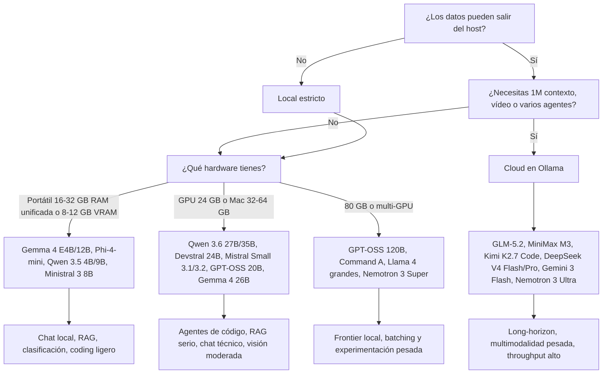

# Informe de decisión sobre los modelos de Ollama

## Resumen ejecutivo

La página de búsqueda de Ollama es, en la práctica, un escaparate dinámico de la misma biblioteca oficial de modelos; para cubrir **todo el catálogo visible y searchable** he tomado como fuente autoritativa la biblioteca oficial `/library`, que en la fecha de consulta muestra **más de un centenar de familias** entre LLMs generalistas, modelos de código, visión, OCR, guardrails y embeddings. No todos merecen el mismo esfuerzo de evaluación: para un lector que quiere decidir qué ejecutar **on-premise**, el valor real está en unas pocas familias punteras y en saber cuáles conviene dejar en **cloud**. citeturn1view0turn3view0turn4view0turn7view0turn8view0

Mi conclusión corta es esta. Si quieres **máximo valor local en 2026**, las familias que más sentido tienen son **Gemma 4**, **Qwen 3.5/3.6**, **Mistral Small 3.x / Devstral**, **GPT-OSS 20B**, **Phi-4 / Phi-4-mini**, **Granite 4.1** y, según el caso, **Command R7B**. Si necesitas **agentes de código de largo alcance, contexto de 1M, multimodalidad fuerte o frontier reasoning**, entonces la balanza se inclina hacia **GLM-5.2**, **MiniMax M3**, **Kimi K2.6/K2.7 Code**, **DeepSeek V4 Flash/Pro**, **Gemini 3 Flash Preview** y **Nemotron 3 Ultra**, todos ellos expuestos por Ollama como modelos cloud o cloud-first. citeturn9view0turn11search0turn13search2turn13search3turn13search9turn13search11turn24search4turn14search15

En local, la decisión correcta depende menos del marketing del modelo y más de cuatro hechos muy prosaicos: **VRAM/RAM disponible, tamaño efectivo tras cuantización, necesidad de contexto largo y tolerancia al riesgo de alucinación**. Ollama soporta cuantización desde FP16/FP32 a `q8_0`, `q4_K_S` y `q4_K_M`, y sus propios documentos dejan claro que la cuantización reduce memoria y puede acelerar inferencia a costa de pérdida de calidad. También fija por defecto el contexto según VRAM disponible: menos de 24 GiB suele quedarse en 4K; 24–48 GiB sube a 32K; y a partir de 48 GiB puede ir a 256K. Para tareas de agentes, coding tools y búsqueda web, Ollama recomienda llegar al menos a 64K. citeturn21search0turn10search0turn11search15

La señal de usuarios encaja bastante bien con la foto técnica. En la comunidad de LocalLLaMA, **Qwen 3.5 35B** aparece repetidamente como uno de los mejores modelos locales para trabajo real; **Gemma 4 26B** recibe elogios como “all around local model”, sobre todo por comportamiento, visión y multilingüismo, aunque con pegas de memoria e integración aún inmadura; **Devstral Small 2** destaca por tool use coherente sobre repositorios; y **GPT-OSS** gusta mucho cuando se usa con sus pesos nativos, pero hay advertencias claras sobre perder calidad si se le aplica una cuantización mediocre. A la vez, hay varias incidencias abiertas en GitHub y Reddit sobre latencia, tool-calling roto o comportamiento extraño en Ollama/OpenWebUI con Qwen 3.5 y algunos Gemma 4. citeturn15search0turn15search1turn15search4turn15search2turn15search3turn15search8turn15search13turn16search6turn16search12turn16search13

## Alcance y método de lectura del catálogo

He tratado **cada tarjeta/familia** del catálogo de Ollama, no cada tag individual. Esa es la granularidad real del buscador y de la biblioteca oficial: por ejemplo, `gemma4`, `qwen3.5`, `gpt-oss` o `llama3.1` son familias con múltiples tamaños y tags. Además, el índice mezcla LLMs con modelos de embeddings, OCR o guardrails; los incluyo porque aparecen en la lista y porque afectan a una arquitectura real de despliegue, pero los separo del shortlist principal. citeturn3view0turn4view0turn4view1turn8view0

Cuando Ollama o el proveedor **no publican hardware mínimo claro**, doy un **estimado conservador** de despliegue local basado en tamaño de parámetros y cuantización 4-bit, dejando claro que es eso: un estimado. La huella real siempre sube por **KV cache, contexto, batching y runtime**. Para no vender humo, donde la licencia, la arquitectura exacta o la disponibilidad local no están claras en la documentación pública localizada, lo marco como **“no especificada”** o **“no verificada aquí”**. citeturn21search0turn21search1turn21search5

También he distinguido entre **local** y **cloud según Ollama**, no según mis recuerdos. En Ollama, los modelos cloud se “offload” al servicio cloud manteniendo el mismo patrón de uso por CLI/API; el mismo API existe en `localhost` y en `ollama.com/api`. Ollama afirma además que su cloud **no retiene** los datos para privacidad y seguridad, que los datos **no se usan para entrenar**, y que se puede desactivar toda funcionalidad cloud con `disable_ollama_cloud` o `OLLAMA_NO_CLOUD=1` para un modo estrictamente local. Ese matiz importa mucho: hay familias como **Gemma 4**, **Qwen 3.5** o **GPT-OSS** que puedes ejecutar localmente, pero que Ollama también ofrece en cloud para tallas/contextos/throughput más exigentes. citeturn11search0turn11search3turn11search4turn11search14turn11search2turn21search6

## Inventario exhaustivo del catálogo consultado

### Familias generativas generalistas y de razonamiento

En la parte generalista/raciocinio del catálogo aparecen, entre otras, estas familias: **gemma2, llama3, phi3, gemma4, qwen3.5, gpt-oss, phi4, gemma, llama2, qwen, qwen2, tinyllama, llama3.3, dolphin3, deepseek-v3, olmo2, smollm2, qwen3.6, granite3.1-moe, orca-mini, mixtral, llama2-uncensored, falcon3, glm-5, mistral-small3.2, qwq, minimax-m2.5, glm-5.1, gemini-3-flash-preview, minimax-m2.7, glm-4.7, deepseek-v3.2, minimax-m2.1, cogito, dolphin-llama3, smollm, gemma3n, llama4, translategemma, phi4-reasoning, dolphin-phi, dolphin-mistral, phi, magistral, command-r, hermes3, granite4, yi, ministral-3, phi4-mini, lfm2.5-thinking, zephyr, mistral-large, glm4, wizardlm2, openthinker, openchat, nous-hermes, deepseek-llm, lfm2, falcon, vicuna, openhermes, qwen2-math, granite3.3, aya, neural-chat, nous-hermes2, llama2-chinese, stablelm2, granite3-dense, granite3.1-dense, aya-expanse, internlm2, starling-lm, solar, xwinlm, granite3-moe, orca2, stable-beluga, exaone-deep, meditron, tinydolphin, mistral-openorca, wizardlm-uncensored, nemotron, qwen3-next, nous-hermes2-mixtral, athene-v2, medllama2, megadolphin, everythinglm, solar-pro, notus, notux, falcon2, exaone3.5, stablelm-zephyr, goliath, granite3.2, olmo-3, r1-1776, sailor2, tulu3, smallthinker, alfred, marco-o1, cogito-2.1, granite4.1, medgemma, medgemma1.5 y laguna-xs.2**. citeturn3view0turn4view0turn7view0turn4view1turn5view0turn5view1turn5view2turn8view0

### Familias orientadas a código, agentes y tool use

En el bloque claramente orientado a desarrollo, repositorios y llamadas a herramientas están **qwen2.5-coder, qwen3-coder, qwen3-coder-next, codellama, deepseek-coder, starcoder2, deepseek-coder-v2, codegemma, codestral, devstral, devstral-small-2, devstral-2, codeqwen, stable-code, wizardcoder, yi-coder, granite-code, sqlcoder, dolphincoder, deepcoder, nexusraven, codegeex4, opencoder, codeup, firefunction-v2, north-mini-code-1.0, kimi-k2.7-code, phind-codellama, codebooga, duckdb-nsql, duckdb-nsql, llama3-groq-tool-use, llama3-chatqa y reader-lm**. Algunos son “true coder models”; otros son más bien agentes o afinados para function calling, browser use o RAG. citeturn3view0turn4view0turn7view0turn5view0turn5view1turn5view2turn8view0

### Multimodalidad, visión, OCR y documento

En multimodal/visión/OCR figuran **llava, minicpm-v, glm-ocr, llama3.2-vision, qwen3-vl, qwen2.5vl, llava-llama3, qwen3.5, gemma4, llama4, moondream, ministral-3, granite3.2-vision, bakllava, llava-phi3, deepseek-ocr, kimi-k2.5, kimi-k2.6, mistral-large-3, minimax-m3, nemotron3, minicpm-v4.6, minicpm-v4.5 y medgemma/medgemma1.5**. Son las familias a mirar si necesitas extracción documental, charts/tables, inspección de capturas, OCR o vídeo. citeturn3view0turn4view0turn7view0turn5view1turn5view2turn8view0

### Seguridad, guardrails, embeddings y auxiliares

Ollama también mezcla varias familias no generativas o de cumplimiento: **mxbai-embed-large, bge-m3, all-minilm, snowflake-arctic-embed, qwen3-embedding, embeddinggemma, paraphrase-multilingual, snowflake-arctic-embed2, nomic-embed-text-v2-moe, granite-embedding, bge-large**, además de guardrails como **shieldgemma, llama-guard3, granite3-guardian, granite4.1-guardian, gpt-oss-safeguard, granite-guardian** y el fact-checker **bespoke-minicheck**. No son tu modelo “principal” de chat, pero sí son muy útiles para **RAG, filtrado, moderation, routing y verificación**. citeturn3view0turn4view0turn7view0turn5view1turn8view0

### Familias cloud etiquetadas por Ollama

Las familias **cloud** visibles en el catálogo incluyen al menos **glm-5.2, minimax-m3, kimi-k2.7-code, nemotron-3-ultra, gemma4, qwen3.5, glm-5.1, minimax-m2.7, nemotron-3-super, glm-5, minimax-m2.5, kimi-k2.6, deepseek-v4-pro, deepseek-v4-flash, kimi-k2.5, gpt-oss, qwen3-coder, glm-4.7, gemini-3-flash-preview, minimax-m2.1**, y en la biblioteca completa además **devstral-small-2, devstral-2, ministral-3, mistral-large-3, nemotron-3-nano, rnj-1** y **qwen3-coder-next**. Esto es importante porque marca el límite práctico entre “puedo correrlo yo” y “Ollama me da el mismo flujo, pero en su nube”. citeturn9view0turn5view1turn5view2turn8view0

## Tabla comparativa priorizada

La tabla siguiente **no sustituye** al inventario exhaustivo; lo aterriza. Resume las familias que hoy tienen más sentido operativo para decidir entre portátil, servidor 24 GB, servidor 80 GB o cloud. Cuando el hardware aparece como **estimado**, significa que el proveedor no publica un mínimo homogéneo y he usado una estimación conservadora para cuantización 4-bit con margen de contexto/KV cache. citeturn21search0turn11search15

| Modelo | Proveedor | Local / cloud | Tamaño estimado | Licencia | HW mínimo para local | Cuantización | Puntos fuertes | Puntos débiles | Casos de uso recomendados |
|---|---|---|---|---|---|---|---|---|---|
| Gemma 4 citeturn3view0turn18search0turn18search9turn11search9 | Google DeepMind | Local y cloud | E2B, E4B, 12B, 26B, 31B | Apache 2.0 | E4B: 8–12 GB VRAM o 16 GB unificada; 26B/31B: 24 GB+ estimado | 8-bit y 4-bit vía Ollama; cloud para tallas grandes | All-rounder muy fuerte, buen multilingüe, visión/audio, buen edge story | Más memoria que otros equivalentes; integración/tooling aún moviéndose rápido | Chat general, coding razonable, visión, portátil moderno, uso offline con buena calidad |
| Qwen 3.5 citeturn3view0turn21search2turn15search0turn15search13 | Alibaba / Qwen | Local y cloud | 0.8B, 2B, 4B, 9B, 27B, 35B, 122B | No verificada aquí con claridad para esta subfamilia | 4B/9B: 8–16 GB; 27B/35B: 24 GB+ estimado | 8-bit y 4-bit vía Ollama | Relación calidad/velocidad muy buena; fuerte en coding y tool use | Usuarios reportan latencia, tool-call roto o thinking largo en algunos stacks | Agentes locales, coding diario, chat técnico, RAG con presupuesto ajustado |
| Qwen 3.6 citeturn4view0turn21search2turn16search10 | Alibaba / Qwen | Local | 27B, 35B | No verificada aquí con claridad | ~24 GB VRAM recomendados por la propia integración Hermes de Ollama | 8-bit y 4-bit vía Ollama | Mejora explícita en coding agente y conservación del “thinking” | Exigente para portátil; menos maduro que 3.5 en ecosistema | Mejor opción local seria para coding/agentes con una sola GPU de 24 GB |
| Mistral Small 3.1 / 3.2 citeturn20search0turn20search2turn6view0 | Mistral AI | Local | 24B | Apache 2.0 | RTX 4090 o Mac con 32 GB RAM, según Mistral | 8-bit y 4-bit; Ollama soporta GGUF q4/q8 | Muy buen equilibrio calidad/latencia; Small 3 oficial habla de 150 tok/s | Menos “frontier” que cloud tope; 24B sigue siendo pesado en laptops normales | Chat rápido, función/tool calling, coding general, edge alto |
| Devstral / Devstral Small 2 citeturn20search8turn5view1turn5view2turn15search4 | Mistral AI | Local y cloud según variante | 24B / 123B | Apache 2.0 para Devstral 24B; 123B en cloud Ollama | 24B: RTX 4090 o Mac 32 GB RAM | 8-bit y 4-bit locales | De lo mejor en agente de código y edición multiarchivo | Puede “pensar lento”; 123B ya pide cloud o hierro serio | SWE tasks, OpenHands, repos grandes, copilotos de ingeniería |
| GPT-OSS citeturn13search5turn19search0turn19search2turn19search4 | OpenAI | Local y cloud | 20B, 120B | Apache 2.0 + usage policy | 20B: 16 GB memoria con MXFP4; 120B: una GPU de 80 GB | Nativo MXFP4; 4/8-bit posibles según runtime | Mucha calidad para razonamiento y agentes; fine-tune con LoRA | Hallucina más que o4-mini y resiste peor ciertas instruction-hierarchy evals; cuantizar mal le sienta fatal | Razonamiento local serio, agentes, personalización con LoRA |
| Phi-4 / Phi-4-mini / Phi-4-reasoning citeturn3view0turn14search3turn14search18turn29search2 | Microsoft | Local | 3.8B / 14B | Licencia Microsoft/MIT según artefacto; revisar modelo exacto | 3.8B: 8–12 GB; 14B: 16–24 GB estimado | 8-bit y 4-bit comunes en la práctica | Excelente rendimiento por parámetro; muy buena matemática/razonamiento | Menos versátil que Gemma/Qwen en uso muy amplio; licencias/artifacts menos uniformes | Edge, reasoning compacto, portátil potente, clasificación y asistentes privados |
| Llama 3.2 / 3.3 / 4 citeturn2search8turn12search17turn28search0turn2search14 | Meta | Local | 1B, 3B, 11B, 70B, Scout/Maverick MoE | Llama Community License | 3.2 1B/3B para edge; 70B y Llama 4 grandes ya necesitan 48–80 GB+ | 8-bit y 4-bit en ecosistema abierto | Ecosistema enorme, fine-tuning y compatibilidad excelentes | En 2026 ya no siempre lidera calidad/latencia frente a Qwen/Gemma/Mistral | Compatibilidad máxima, proyectos heredados, edge Arm, fine-tuning |
| Granite 4.1 citeturn6view2turn14search7turn14search12 | IBM | Local | 3B, 8B, 30B | Apache 2.0 | 8B: 12–16 GB; 30B: 24–32 GB estimado | FP8 opcional oficial; 8/4-bit en ecosistema Ollama | Empresa, tool use, JSON estructurado, RAG y gobernanza | Menos “wow factor” en chat puro | Enterprise RAG, extracción estructurada, entornos con compliance |
| Command R7B / Command A / Command R+ citeturn8view0turn14search4turn14search19turn14search9 | Cohere | Local | 7B, 104B, 111B | No especificada claramente en las fuentes consultadas | R7B cabe en commodity GPU; A/R+ ya son de hierro serio | 8/4-bit locales habituales | RAG, enterprise chat y agents de muy buena calidad; R7B rápido | Familias grandes pesadas; ecosistema comunitario menor que Qwen/Llama | Chat empresarial, recuperación, agentes con latencia sensible |
| GLM-5.2 citeturn9view0turn13search2turn13search7turn25search1 | Z.ai | Cloud | No expuesto por Ollama en tamaño; familia frontier | MIT | No aplica local en Ollama hoy | No aplica | 1M de contexto útil y foco claro en long-horizon engineering | Dependencia cloud; coste y residencia fuera del perímetro | Tareas largas de ingeniería, repositorios enormes, agentes multi-paso |
| MiniMax M3 citeturn9view0turn13search3turn13search8 | MiniMax | Cloud | No especificado por Ollama; 1M context | No especificada públicamente aquí | No aplica local en Ollama hoy | No aplica | Frontier para coding/agentic, multimodal nativo, 1M contexto | Cloud-only práctico; menos evidencias de despliegue privado | Coding largo, multimodal, agentes con vídeo/escritorio |
| Kimi K2.6 / K2.7 Code citeturn13search9turn13search14turn25search3 | Moonshot AI | Cloud | No especificado por Ollama | No especificada claramente en fuentes públicas consultadas | No aplica local en Ollama hoy | No aplica | Muy fuerte en coding largo, agentes y multimodalidad | Dependencia cloud y menor claridad pública sobre licencia de pesos | Agentes de software, diseño+implementación, workflows largos |
| DeepSeek V4 Flash / Pro citeturn13search1turn13search11turn13search16 | DeepSeek | Cloud | Flash 284B total/13B activos; Pro 1.6T/49B activos | No especificada aquí con claridad | No aplica local en Ollama hoy | No aplica | 1M contexto, modos thinking/no-thinking, coste/rendimiento fuerte | Cloud-only práctico; más complejidad operacional | Reasoning de gran contexto, routing, agentes frontier |
| Gemini 3 Flash Preview citeturn6view0turn24search1turn24search4turn24search16 | Google | Cloud | 1M / 64K de contexto I/O en API oficial | Cerrado / API de Google | No aplica local | No aplica | Velocidad, multimodalidad y agentic vision muy fuertes | Es preview; hubo reportes de bugs en parallel function calls | Visión, análisis documental, agentes rápidos, lotes grandes |
| Nemotron 3 Super / Ultra / Nano citeturn4view0turn5view2turn14search5turn14search10turn14search15 | NVIDIA | Local y cloud según variante | Nano 4B/30B, Super 120B A12B, Ultra cloud | NVIDIA Nemotron Open Model License | Nano 4B local accesible; Super/Ultra ya implican 80 GB o cloud | Cuantización y kernels NVIDIA optimizados | Muy buenos para agentes, razonamiento y alto throughput | Ecosistema más nicho y mejor aprovechado con stack NVIDIA | Agentes empresariales, ciber, infra NVIDIA, alto throughput |

## Qué familias merecen atención real hoy

### Para portátil, sobremesa modesta y edge

Si tu realidad es **16–32 GB de RAM unificada** o una **GPU de 8–12 GB**, no intentes hacerte el héroe con modelos de 30B. Ahí ganan casi siempre **Gemma 4 E4B/12B**, **Phi-4-mini**, **Qwen 3.5 4B/9B**, **Ministral 3 3B/8B**, **Granite 4.1 3B/8B** y **Llama 3.2 1B/3B**. Google está empujando Gemma 4 muy fuerte en edge y afirma que su 12B puede llevarse a portátil de 16 GB en su stack AI Edge; Mistral posiciona Ministral 3 explícitamente como edge; Meta hizo lo propio con Llama 3.2 1B/3B para Arm y edge; y Microsoft sigue siendo muy competitiva por parámetro con Phi. citeturn18search9turn20search3turn20search5turn28search6turn14search13

Mi recomendación práctica aquí es poco romántica: **para conversación general y multilingüe, Gemma 4**; **para coding local barato, Qwen 3.5 9B o Phi-4-mini**; **para RAG/JSON enterprise, Granite 4.1 8B**; y **si lo que quieres es máxima compatibilidad/ecosistema**, Llama 3.2 sigue siendo una apuesta sensata. La comunidad castiga poco a Gemma 4 en uso general y bastante poco a Qwen 3.5 en coding diario, aunque hay hilos en español e inglés describiendo problemas reales de tool use, modo “thinking” o pérdida de contexto en algunos stacks concretos con Qwen y OpenCode/OpenWebUI. citeturn16search6turn16search8turn16search10turn15search5

### Para una sola GPU de 24 GB o un Mac de 32–64 GB

Aquí está la verdadera zona dulce de 2026. En este segmento compiten **Qwen 3.6 27B/35B**, **Gemma 4 26B/31B**, **Mistral Small 3.1/3.2 24B**, **Devstral 24B**, **GPT-OSS 20B** y, si tu prioridad es RAG, **Command R7B**. Mistral dice explícitamente que Mistral Small 3/3.1 y Devstral están pensados para caber en una **RTX 4090 o un Mac de 32 GB**, y el propio asistente Hermes de Ollama recomienda **Gemma 4 (~16 GB VRAM)** y **Qwen 3.6 (~24 GB VRAM)** como modelos locales destacados. OpenAI, por su parte, sitúa **gpt-oss-20b** como un modelo que puede ejecutarse con **16 GB** cuando usas sus pesos nativos **MXFP4**. citeturn20search0turn20search2turn20search8turn21search2turn19search0turn19search2

Si vas a programar de verdad, aquí el podio práctico queda así. **Devstral 24B** es probablemente el más orientado a “resolver tickets y editar varios archivos”. **Qwen 3.6** es la apuesta más agresiva si te importa coding+thinking+visión localmente. **GPT-OSS 20B** es muy atractivo si quieres razonamiento fuerte y además planeas **afinar con LoRA**. **Gemma 4 26B** es la opción más redonda si no vives exclusivamente dentro del IDE. Los usuarios lo reflejan bastante bien: un hilo sobre Devstral Small 2 lo describe como “shockingly useful” y remarca que “tool use actually works consistently well”; sobre Qwen 3.5/3.6 hay entusiasmo real, pero también issues abiertos por latencia, tool-calls formateados como texto y grandes diferencias de velocidad entre Ollama y otros runtimes; y sobre Gemma 4 se repite el patrón “muy bueno, pero más memoria y algo verde”. citeturn15search4turn15search9turn15search3turn15search8turn15search13turn15search1turn15search6

### Para cloud, frontier y trabajo que localmente te destroza la máquina

Hay un punto a partir del cual el romanticismo on-premise sale caro. Si necesitas **1M de contexto, visión/vídeo fuerte, agentic coding largo, repositorios enormes, varios agentes en paralelo o throughput de centro de datos**, conviene usar las variantes cloud de Ollama o ir directamente al proveedor. En ese territorio están **GLM-5.2**, **MiniMax M3**, **Kimi K2.6/K2.7 Code**, **DeepSeek V4 Flash/Pro**, **Gemini 3 Flash Preview**, **Mistral Large 3**, **Nemotron 3 Ultra/Super** y ciertos tags cloud de **gpt-oss**, **qwen3-coder** o **gemma4**. Ollama dice claramente que su cloud existe precisamente para ejecutar modelos que no caben bien en un PC personal, manteniendo el mismo flujo de herramientas local. citeturn11search0turn21search6turn9view0

Mi shortlist cloud, sin rodeos, sería este. **GLM-5.2** para ingeniería de largo alcance y proyectos grandes; **MiniMax M3** para coding+multimodal con 1M contexto; **Kimi K2.7 Code** si el centro de gravedad es programación compleja; **DeepSeek V4 Flash** si la relación capacidad/coste importa mucho; **DeepSeek V4 Pro** si quieres un frontier más gordo; y **Gemini 3 Flash Preview** si la tarea es muy multimodal y muy rápida. Para empresas con base NVIDIA, **Nemotron 3 Super/Ultra** también merece atención por foco claro en agentes y throughput. citeturn13search7turn13search8turn13search9turn13search11turn24search4turn14search5turn14search15

La diferencia de privacidad aquí no es trivial. **Local** significa perímetro propio y, si quieres, desconexión total desactivando cloud. **Cloud de Ollama** significa que mantienes experiencia uniforme y, según Ollama, que los datos no se retienen ni se usan para entrenar; aun así, en una organización regulada eso sigue siendo sacar datos de tu host y entrar en consideraciones de residencia, contrato y logging externo. Ollama indica además que su infraestructura cloud está en Estados Unidos, Europa y Singapur. Traducido a castellano llano: si la política interna es “nada sale”, usa local sí o sí; si la política es “sale bajo contrato y control”, el cloud de Ollama es bastante más cómodo de lo que era el bricolaje habitual hace dos años. citeturn11search14turn11search4turn11search2

## Opiniones de usuarios y lo que sí se repite en producción

La opinión de usuarios es ruidosa, pero no aleatoria. Sobre **Qwen 3.5**, la señal dominante es: “calidad muy alta para local”, especialmente en talla media, pero con una letra pequeña importante sobre tool use y runtimes. En LocalLLaMA, un usuario habla de **35B-A3B** como “one of the best local model”; otro describe los modelos medianos como “awesome for local code setups”; y, a la vez, hay issues en Ollama con segundos prompts que tardan 30–60 s en arrancar, con respuestas mucho más lentas que en llama.cpp, o con tool-calls impresos en texto plano en lugar de ejecutarse. En español, también hay hilos diciendo directamente que `qwen3.5` con OpenCode/OpenWebUI “funciona como una mierda” o que se vuelve “no usable” en uso de herramientas. citeturn15search0turn15search5turn15search3turn15search8turn15search13turn16search6turn16search12

Sobre **Gemma 4**, la comunidad repite otra melodía: comportamiento más limpio y más “usable” como asistente general, con visión y multilingüismo sólidos, pero coste de memoria algo mayor y bastantes bordes todavía verdes en integración. Un hilo muy citado compara **Gemma 4 26B** con Qwen 3.5 35B en Mac Studio y dice, en esencia, que va a velocidad comparable pero “se comporta mucho mejor”; otro usuario la llama directamente “the perfect all around local model”; y, en español, aparece la percepción de que **Gemma** entiende especialmente bien idiomas fuera del inglés y el chino. Por contra, también hay reportes recientes de problemas con prompts de sistema, uso de herramientas o configuración en VSCode/OpenWebUI. citeturn15search1turn15search6turn15search11turn16search5turn16search7turn16search13

**Devstral** sale sorprendentemente bien parado en testimonios reales de desarrollo. Un hilo de usuarios de **Devstral 2 / Small 2** lo describe como un modelo que “blows every other ‘small’ local model away” en Zed/Ollama, y otro subraya que fue “the only model” que logró una respuesta parcialmente correcta en una tarea de RL/código donde otros fallaban. Eso casa con el posicionamiento oficial de Mistral: Devstral está diseñado para explorar repositorios, editar múltiples ficheros y alimentar agentes de software. citeturn15search4turn15search9turn20search8

En **GPT-OSS** la conversación es más matizada. El entusiasmo existe —en Hacker News se llega a decir que es “probably the best you can run on your own hardware today”—, pero la advertencia recurrente es técnica: **si lo degradan malas cuantizaciones, pierde mucho**. OpenAI, de hecho, empuja el uso de **MXFP4 nativo** y aclara que usar `bfloat16` en vez de MXFP4 sube mucho el consumo de memoria. Además, su model card reconoce algo importante para despliegues serios: **gpt-oss-120b y 20b alucinan más que o4-mini** en SimpleQA y PersonQA, y rinden peor en parte de las evaluaciones de instruction hierarchy. No es un deal breaker, pero sí una razón para combinarlo con search, RAG o guardrails si lo pones en producción. citeturn15search2turn15search17turn19search2turn19search1

## Recomendaciones de despliegue y guía rápida de elección

### Regla práctica de despliegue

La regla más útil no es “pon el mayor que quepa”, sino esta:

- Si tienes **privacidad estricta, datos sensibles, necesidad offline o coste fijo**, empieza por **local**.
- Si el caso exige **vídeo, 1M contexto, varios agentes, repos grandes o frontier reasoning**, usa **cloud**.
- Si el modelo cabe **sólo** apretando demasiado o sacrificando contexto, probablemente estás eligiendo mal el sitio donde correrlo. citeturn11search0turn11search14turn11search15

### Configuración local que suele funcionar

Empieza con **contexto sobrio**, no con 128K por defecto. Ollama dimensiona el contexto por VRAM y deja claro que el contexto largo encarece memoria; para coding agents y web search recomienda ir a **64K o más**, pero eso sólo cuando de verdad lo necesitas. En local interactivo normal, 8K–32K suele ser una zona sensata; subir sin necesidad te mata latencia y KV cache. citeturn11search15

En cuanto a cuantización, lo razonable es esto: **Q4_K_M** como configuración pragmática para la mayoría de pruebas locales; **Q8_0** cuando la calidad importa más que el tamaño y aún te cabe; y, en familias con pesos nativos especiales, respetar el formato del fabricante siempre que puedas. El ejemplo más claro es **GPT-OSS**, donde OpenAI recomienda explícitamente **MXFP4** y varios usuarios avisan de que cuantizarlo “a lo bruto” empeora mucho el resultado. citeturn21search0turn19search2turn15search2

Si vas a adaptar el modelo, evita el fine-tuning “full” salvo que tengas presupuesto serio. En práctico, el camino sigue siendo **LoRA/QLoRA**. OpenAI documenta LoRA para `gpt-oss`, y el paper de **QLoRA** mostró ya hace tiempo que la afinación eficiente sobre modelos cuantizados permite adaptar incluso modelos grandes con una sola GPU de 48 GB. Para pymes y equipos internos, esto sigue siendo el mejor ROI. citeturn19search4turn23academia13

### Guía rápida por escenario

| Escenario | Modelos recomendados | Comentario |
|---|---|---|
| Portátil fino, 16–32 GB, offline | Gemma 4 E4B/12B, Phi-4-mini, Qwen 3.5 4B/9B, Ministral 3 8B | Gemma 4 es el mejor comodín; Phi-4-mini si prima reasoning; Qwen si prima coding citeturn18search9turn14search18turn20search3turn15search5 |
| Una RTX 4090 o GPU 24 GB | Devstral 24B, Qwen 3.6 27B/35B, Mistral Small 3.1/3.2, GPT-OSS 20B | Es la franja más interesante para agentes y coding local serio citeturn20search0turn20search8turn21search2turn19search0 |
| Mac Studio o servidor 64 GB+ | Gemma 4 26B/31B, Qwen 3.5 35B, Llama 3.3 70B, Command A si cabe | Más calidad general, más contexto y mejor batching, pero con coste térmico/latencia mayor citeturn3view0turn2search14turn14search9 |
| Multi-GPU / 80 GB | GPT-OSS 120B, Nemotron 3 Super, Llama 4 grandes, Mistral Medium 3.5 | Para frontier local experimental o servicios internos potentes citeturn19search0turn14search15turn28search0turn8view0 |
| Privacidad estricta, air-gapped | Local + `OLLAMA_NO_CLOUD=1` + guard model | Combina LLM principal con guardrails tipo Granite Guardian, ShieldGemma o Llama Guard citeturn11search2turn14search17turn8view0turn7view1 |
| Largas cadenas agente + 1M contexto | GLM-5.2, MiniMax M3, Kimi K2.7 Code, DeepSeek V4 Flash/Pro | No merece la pena pelearlo en portátil; aquí cloud gana con claridad citeturn13search7turn13search8turn25search3turn13search1 |

### Cuándo conviene cloud aunque el modelo tenga variante local

Te conviene **cloud** aunque exista variante local cuando ocurra cualquiera de estas tres cosas. Primero, si el trabajo es **largo y abierto**, no sólo “responder un prompt”: navegar un repo, iterar con herramientas, abrir documentos enormes, pasar por OCR, generar y corregir. Segundo, si tu cuello de botella es **throughput**, no privacidad. Tercero, si el caso necesita **datos frescos** y vas a combinarlo con búsqueda web, porque Ollama integra web search precisamente para reducir alucinaciones y mejorar exactitud en tareas vivas. citeturn11search17turn11search18turn13search7turn13search9

Mi recomendación de arquitectura es muy simple: **modelo local por defecto + escalado táctico a cloud**. Por ejemplo: Gemma 4 o Qwen 3.6 como modelo principal local; Granite Guardian o ShieldGemma como filtro; embeddings dedicados para RAG; y una ruta cloud a **GLM-5.2 / Kimi / MiniMax / DeepSeek** para tareas con 1M contexto, multimodalidad pesada o razonamiento especialmente costoso. Es la forma más limpia de mantener privacidad por defecto sin renunciar a capacidad frontier cuando de verdad hace falta. citeturn11search0turn14search17turn17search4turn13search7turn13search9turn13search11

### Línea temporal útil para entender por qué el catálogo está así

El catálogo actual no salió de la nada. **Llama 2** abrió la puerta en julio de 2023; **Llama 3 y 3.1** consolidaron el ecosistema abierto en 2024; **Llama 3.2** llevó parte de esa historia al edge y a la visión; **Qwen 2.5**, **Qwen 2.5 Coder** y **Qwen 2.5-VL** hicieron muy competitivo el open source en 2024; **Mistral Small 3** y **Devstral** empujaron fuerte el “small but real” para coding/agents en 2025; **GPT-OSS** llegó en agosto de 2025 como golpe serio de OpenAI al segmento local; a finales de 2025 despegaron **Gemini 3 Flash** y **Mistral 3/Ministral 3**; y en 2026 el foco se movió claramente a **Gemma 4**, **GLM-5.x**, **DeepSeek V4**, **MiniMax M2.7/M3**, **Kimi K2.6/K2.7**, **Nemotron 3** y **Granite 4.1**. Esa secuencia explica por qué muchos modelos “legendarios” del catálogo siguen ahí, pero ya no son la primera recomendación operativa. citeturn12search20turn12search11turn12search5turn12search17turn17search11turn17search5turn17search12turn20search2turn12search18turn13search5turn24search1turn20search1turn18search0turn25search17turn13search11turn25search6turn13search3turn13search14turn14search15turn14search7

En limpio: si hoy tuviera que montar un stack local serio en Ollama, elegiría **Gemma 4** como asistente general, **Devstral** o **Qwen 3.6** para coding/agentes, **Granite 4.1** o **Command R7B** para RAG empresarial, y un **fallback cloud** hacia **GLM-5.2** o **Kimi/MiniMax/DeepSeek** para los trabajos largos que, honestamente, un portátil no debería sufrir. Eso te da la mejor mezcla actual de soberanía, coste y capacidad. citeturn18search0turn20search8turn21search2turn14search12turn14search4turn13search7turn13search9turn13search3turn13search11