# AI Broker — Mapa Exhaustivo de Casos de Uso y Pantallas Originales

Este documento recoge el inventario completo de capacidades, casos de uso y flujos operativos del **AI Broker**, mapeados directamente contra sus pantallas web originales (`http://127.0.0.1:8765/dashboard`). Sirve como referencia central y guion de contenidos para la formación audiovisual.

---

## 1. Arquitectura y Filosofía del Sistema

```mermaid
graph TD
    A[AI Broker: Central de Inferencia] --> B[Operación y Flujo de Peticiones]
    A --> C[Ingesta Multimodal y Documental]
    A --> D[Consenso Multi-Modelo MoA]
    A --> E[Agentes y Sandbox Docker]
    A --> F[Diagnóstico y Optimización]
    A --> G[Auditoría, Trazabilidad y Recursos]

    B --> B1[Inferencia Directa Single]
    B --> B2[Enrutamiento Autónomo Auto]
    B --> B3[Gestión de Cola y Prioridades]

    C --> C1[OCR de PDFs y Documentos]
    C --> C2[Transcripción Audio/Vídeo Whisper]
    C --> C3[Visión sobre Imágenes y Gráficos]

    D --> D1[MoA Fast Serial]
    D --> D2[MoA Slow Paralelo/Oleadas]
    D --> D3[Consenso Multironda y Árbitro]

    E --> E1[Bucle de Herramientas Web/Calc]
    E --> E2[Ejecución Aislada de Código]
    E --> E3[Cotejo Determinista de Enlaces]

    F --> F1[Probador de Prompts y Schemas]
    F --> F2[Líneas Temporales de Comparación]
    F --> F3[Compresión Reactiva de Prompts]

    G --> G1[Dashboard Operativo y VRAM]
    G --> G2[Transparencia del Meta-Router]
    G --> G3[Ciclo de Vida y Borrado Seguro de Modelos]
    G --> G4[Ajuste en Caliente del Broker]
```

### Principios Fundamentales
1. **La evidencia es el producto:** Todo dato mostrado procede de SQLite, de un sondeo en vivo o de un snapshot del runtime con timestamp verificado. No existen métricas simuladas, barras de carga artificiales ni datos inventados (`N/D` con su motivo cuando falta información).
2. **Frontera de datos contractualmente vinculante:** `risk.data_classification` (`confidential`, `local_only`, `internal`, `public`) desactiva proveedores cloud y herramientas de red (`web_search`, `fetch_url`) a nivel de validación Pydantic estricta (v2.9).
3. **Invariante de concurrencia y doble carril:**
   - **Carril de inferencia:** Un único workflow activo global (`max_active_workflows: 1`) para evitar contención en la GPU.
   - **Carril de conversiones:** Tareas de ingesta documental (`ingestion.max_concurrent: 1`) corren en paralelo sin bloquear la inferencia.
4. **Diseñado para segundo monitor:** Tema oscuro templado, sin fatiga visual, legible de reojo. Auto-refresco hipermedia (HTMX) sin dependencias externas (CSS/JS 100% locales servidos sin CDN).

---

## 2. Inventario Detallado de Casos de Uso por Bloques

---

### Bloque 1: Inferencia Básica y Enrutamiento Inteligente

#### Caso de Uso 1.1: Consulta Directa con Modelo Específico (`single`)
* **Objetivo:** Enviar un prompt a un modelo exacto de Ollama, LM Studio, DeepSeek o proveedor custom OpenAI-compatible, forzando la respuesta sin intermediarios.
* **Pantallas de la App:**
  * **Probador de Prompts** (`/dashboard/prompt-tester`).
  * **Detalle de la Tarea** (`/dashboard/tasks/{task_id}`).
* **Flujo en la Interfaz:**
  1. En el Probador, seleccionar **Estrategia: Modelo único**.
  2. Filtrar y elegir el modelo en el combo autocompletable `single_model` (solo aparecen modelos operativos con compatibilidad verificada).
  3. Ajustar temperatura, tokens máximos y formato de salida (Markdown/Texto/JSON).
  4. Pulsar **Validar** para comprobar el payload del contrato Pydantic en tiempo real en el panel "Request validado".
  5. Pulsar **Encolar**: se genera el banner de tarea encolada con enlace al ID y widget de seguimiento en vivo (`task-status-panel`).
* **Valor diferencial formativo:** Previene fallos antes de consumir recursos descartando modelos no compatibles.

#### Caso de Uso 1.2: Enrutamiento Autónomo por Meta-Router (`strategy: auto`)
* **Objetivo:** Dejar que el Broker clasifique la petición por heurística y decida si conviene un modelo único, un agente con herramientas o un comité deliberativo, escalando si la confianza es baja.
* **Pantallas de la App:**
  * **Probador de Prompts** (`/dashboard/prompt-tester`).
  * **Enrutamiento** (`/dashboard/routing`).
  * **Detalle de la Tarea** (`/dashboard/tasks/{task_id}`).
* **Flujo en la Interfaz:**
  1. Emitir la petición con estrategia automática.
  2. En el detalle de la tarea, observar el evento `strategy.routed` explicando los motivos exactos (longitud, detección de cálculo, recencia, etc.).
  3. Si la confianza del modelo es insuficiente, observar la alerta de `strategy.escalated` (escalado a Mixture).
  4. En la pantalla **Enrutamiento**, examinar la tabla de **Aprendizaje por tipo de petición**: ver cómo los casos acumulados van refinando las recomendaciones sobre la heurística inicial.
* **Valor diferencial formativo:** La IA no es una "caja negra": cada decisión deja huella auditable y aprende empíricamente de la experiencia.

#### Caso de Uso 1.3: Extracción Estructurada con Validación JSON Schema
* **Objetivo:** Obligar al modelo a responder estrictamente bajo un esquema JSON tipado.
* **Pantallas de la App:**
  * **Probador de Prompts** (sección "Límites y salida").
  * **Detalle de la Tarea** (pestaña Resultado y JSON).
* **Flujo en la Interfaz:**
  1. Seleccionar **Formato salida: JSON**.
  2. En el campo emergente `JSON Schema de salida`, escribir el esquema deseado.
  3. El panel comprueba si el modelo soporta nativamente `json_mode` según los sondeos de compatibilidad. Si no lo soporta, lanza una advertencia en vivo.
  4. Al finalizar, el detalle de la tarea formatea y valida el JSON de respuesta.
* **Valor diferencial formativo:** Previene respuestas rotas en integraciones con APIs externas.

---

### Bloque 2: Ingesta Documental y Procesamiento Multimodal

#### Caso de Uso 2.1: Ingesta de Documentos Complejos (PDFs con OCR)
* **Objetivo:** Convertir informes en PDF a Markdown limpio con OCR página por página antes de pasárselos a los LLMs.
* **Pantallas de la App:**
  * **Ficheros** (`/dashboard/files`).
  * **Visor de Markdown** (`/dashboard/files/{id}/markdown`).
  * **Probador de Prompts** (lista de adjuntos listos).
* **Flujo en la Interfaz:**
  1. En la página **Ficheros**, subir un PDF arrastrándolo al formulario.
  2. Marcar la opción de OCR si el documento contiene páginas escaneadas.
  3. Elegir si las figuras se describen mediante modelo de visión o se omiten para máxima velocidad.
  4. Ver cómo la fila pasa de `converting` a `ready`, mostrando el motor usado (Docling), páginas, peso y **tokens estimados**.
  5. Hacer clic en "Ver Markdown" para inspeccionar el texto y tablas extraídos.
  6. En el Probador, marcar la casilla del fichero: el Markdown se inyecta encapsulado en tags XML seguros `<attached_document>`.
* **Valor diferencial formativo:** El carril de ingesta no bloquea la inferencia y protege al modelo con advertencias anti-inyección.

#### Caso de Uso 2.2: Transcripción de Audio y Vídeo con Faster-Whisper Local
* **Objetivo:** Subir grabaciones de reuniones (.mp3, .wav, .mp4, .mkv) y obtener transcripciones textuales listas para resumen.
* **Pantallas de la App:**
  * **Ficheros** (`/dashboard/files`).
  * **Resumen Operativo** (`/dashboard`, widget Carga de la máquina).
* **Flujo en la Interfaz:**
  1. Subir un archivo multimedia.
  2. En Resumen, comprobar la ocupación del carril de conversiones (`ingestion 1/1`) mientras la inferencia continúa libre.
  3. Al terminar, la tabla de Ficheros enseña la duración formateada y el botón para leer el Markdown transcrito.
* **Valor diferencial formativo:** Desacoplamiento de carriles y transcripción 100% privada sin salida a internet.

#### Caso de Uso 2.3: Inferencia con Imágenes y Modelos de Visión
* **Objetivo:** Analizar capturas de pantalla, planos, diagramas o fotos enviándolas intactas a un modelo con soporte visual.
* **Pantallas de la App:**
  * **Ficheros** (`/dashboard/files`, visor `/dashboard/files/{id}/original`).
  * **Probador de Prompts** (`/dashboard/prompt-tester`).
* **Flujo en la Interfaz:**
  1. Subir una imagen (.png, .jpg, .webp).
  2. En Ficheros, la imagen nace inmediatamente como `ready` (sin conversión a texto) y ofrece "Ver imagen".
  3. En el Probador, al marcar la imagen, el catálogo de modelos se filtra automáticamente a modelos con visión sondeada.
  4. Si se intentara ejecutar con un modelo solo de texto, el Broker rechaza la tarea con `VISION_MODEL_UNAVAILABLE`.
* **Valor diferencial formativo:** Una imagen nunca se degrada silenciosamente a texto si hay un modelo capaz de verla.

#### Caso de Uso 2.4: Manejo de Contextos Gigantes mediante Map-Reduce
* **Objetivo:** Procesar múltiples libros o expedientes adjuntos que superen la ventana de contexto del modelo.
* **Pantallas de la App:**
  * **Probador de Prompts** (casilla "Trocear si los adjuntos no caben (map-reduce)").
  * **Detalle de la Tarea** (`/dashboard/tasks/{task_id}`).
* **Flujo en la Interfaz:**
  1. Adjuntar documentos extensos.
  2. Activar la casilla `long_context_map_reduce`.
  3. El coordinador trocea los documentos en fragmentos seguros, los procesa en oleadas y sintetiza la respuesta final sin sobrecargar la ventana del modelo ni truncar en silencio.

---

### Bloque 3: Consenso Multi-Modelo (Mixture of Agents)

#### Caso de Uso 3.1: Deliberación Rápida Serial (`mixture_of_agents/fast`)
* **Objetivo:** Obtener una respuesta de máxima calidad donde 2 a 5 modelos especialistas proponen y un árbitro sintetiza la conclusión final.
* **Pantallas de la App:**
  * **Probador de Prompts** (`/dashboard/prompt-tester`).
  * **Comparación** (`/dashboard/comparison`).
  * **Detalle de la Tarea** (`/dashboard/tasks/{task_id}`).
* **Flujo en la Interfaz:**
  1. En el Probador, seleccionar **Estrategia: Mixture of LLMs**, **Preset: fast**.
  2. Asignar roles y modelos a los proponentes (ej. Proponente 1: `specialist`, Proponente 2: `skeptic`).
  3. Seleccionar el Árbitro (ej. DeepSeek-R1 o modelo más capaz).
  4. Encolar la tarea.
  5. En **Comparación**, observar la línea temporal serial: Proponente 1 → Proponente 2 → Árbitro.
  6. Revisar el desglose de tokens y coste individual de cada proponente y la síntesis generada.
* **Valor diferencial formativo:** Propuestas encapsuladas en sandboxes XML neutralizados contra inyecciones de prompt entre modelos.

#### Caso de Uso 3.2: Deliberación Concurrente con Arbitraje de VRAM (`mixture_of_agents/slow`)
* **Objetivo:** Ejecutar múltiples modelos locales en paralelo o por oleadas (*waves*) exprimiendo la GPU sin provocar fallos de Out Of Memory (OOM).
* **Pantallas de la App:**
  * **Probador de Prompts** (preset `slow`, scheduling `adaptive`/`parallel`/`waves`).
  * **Comparación** (`/dashboard/comparison`).
  * **Resumen Operativo** (monitor de VRAM en vivo).
* **Flujo en la Interfaz:**
  1. Configurar un Mixture con preset `slow`.
  2. El `ResourceScheduler` consulta la VRAM libre de Ollama (`/api/ps`) y decide el plan seguro (`parallel`, `waves` o `sequential`).
  3. En **Comparación**, observar los carriles temporales: se comprueba si hubo solapamiento medido real (`started_at` vs `completed_at`).
  4. El árbitro espera a la barrera de finalización de todos los proponentes antes de iniciarse.
* **Valor diferencial formativo:** La pantalla no simula paralelismo: solo se muestra solapamiento cuando los timestamps demuestran que corrieron simultáneamente.

#### Caso de Uso 3.3: Consenso de Doble Ronda con Evaluación de Confianza
* **Objetivo:** Someter la respuesta a un segundo filtro de calidad solo si un juez determina que la síntesis de la primera ronda no alcanza el umbral de certeza.
* **Pantallas de la App:**
  * **Detalle de la Tarea** (`/dashboard/tasks/{task_id}`).
  * **Configuración** (`/dashboard/config`).
* **Flujo en la Interfaz:**
  1. El broker ejecuta la Ronda 1 y el juez evalúa la síntesis.
  2. Si la puntuación no llega al umbral, en el detalle aparece el badge informativo `consensus.round_gate`.
  3. Los proponentes reciben la primera síntesis para hacer enmiendas y el árbitro emite el veredicto definitivo.
  4. Si la segunda ronda falla, el broker entrega la primera síntesis para no perder el trabajo ya pagado.

---

### Bloque 4: Agentes Autónomos y Sandbox de Código Seguro

#### Caso de Uso 4.1: Agente con Búsqueda Web y Cotejo Determinista de Citas
* **Objetivo:** Resolver preguntas de actualidad o documentación externa permitiendo que el modelo busque en Internet y navegue por URLs con protección anti-alucinación.
* **Pantallas de la App:**
  * **Probador de Prompts** (Estrategia: `Agente con skills`, casillas `Búsqueda web` y `Leer URL`).
  * **Detalle de la Tarea** (sección "Actividad del agente").
* **Flujo en la Interfaz:**
  1. Activar la estrategia Agente y seleccionar las skills `web_search` y `fetch_url`.
  2. Encolar y abrir el detalle de la tarea:
     * Ver el timeline interactivo con cada iteración `#1`, `#2`... mostrando la llamada generada y el resultado de la búsqueda.
     * Examinar el bloque de **Citas**: el broker comprueba si los enlaces que el agente menciona en su texto final fueron realmente consultados o si son inventados (`unsupported citations`).
* **Valor diferencial formativo:** Protección SSRF activa (resuelve DNS y bloquea IPs locales/privadas para impedir ataques a la intranet).

#### Caso de Uso 4.2: Ejecución Aislada de Python en Contenedor Docker (`run_code`)
* **Objetivo:** Permitir que el modelo escriba y ejecute scripts para realizar cálculos complejos, procesar datos de tablas o generar gráficos sin riesgo para el sistema operativo anfitrión.
* **Pantallas de la App:**
  * **Probador de Prompts** (Skill: `Ejecutar código (sandbox)`).
  * **Detalle de la Tarea** (galería de artefactos e imágenes).
* **Flujo en la Interfaz:**
  1. Activar la skill de sandbox en el agente.
  2. El modelo genera código Python con matplotlib o pandas.
  3. El broker levanta un contenedor Docker desechable (`--network none`, `--read-only`, usuario `nobody`, `--cap-drop ALL`).
  4. El script se ejecuta, devuelve stdout/stderr al modelo y, si genera archivos o imágenes, se extraen automáticamente.
  5. En el detalle de la tarea, en la sección **Artefactos**, la imagen generada se visualiza directamente en la galería con enlace de descarga en alta resolución.
* **Valor diferencial formativo:** Frontera de seguridad infranqueable: el código de la IA jamás toca el disco host de Windows.

#### Caso de Uso 4.3: Proponentes de Mixture Potenciados con Herramientas
* **Objetivo:** Combinar deliberación multi-modelo con capacidades de búsqueda/cálculo, de forma que cada proponente investigue antes de debatir.
* **Pantallas de la App:**
  * **Probador de Prompts** (bloque `Dar herramientas a los proponentes`).
* **Flujo en la Interfaz:**
  1. Configurar un Mixture manual.
  2. Marcar `Dar herramientas a los proponentes`.
  3. Cada proponente consulta fuentes o realiza cálculos independientemente antes de emitir su propuesta al árbitro (el árbitro permanece estrictamente como juez sintetizador sin acceso a red).

---

### Bloque 5: Privacidad, Seguridad y Compresión

#### Caso de Uso 5.1: Blindaje de Datos Mediante Clasificación Contractual (`data_classification`)
* **Objetivo:** Garantizar que información confidencial o sensible de la empresa nunca salga del equipo local bajo ninguna circunstancia.
* **Pantallas de la App:**
  * **Probador de Prompts** (desplegable "Clasificación de datos").
  * **Configuración** (`/dashboard/config`).
* **Flujo en la Interfaz:**
  1. Cambiar la clasificación de `Pública` a **`Confidencial`** o **`Solo local`**.
  2. Observar en el panel "Impacto operativo validado" cómo la interfaz marca automáticamente: `Cloud bloqueado`.
  3. Los proveedores remotos quedan descartados a nivel de esquema Pydantic.
  4. Las herramientas con salida a Internet (`web_search`, `fetch_url`) son rechazadas automáticamente.
* **Valor diferencial formativo:** Mando único de privacidad: no hay casillas contradictorias que puedan inducir a error humano.

#### Caso de Uso 5.2: Ahorro de Tokens y Costes con Compresión Reactiva de Prompts
* **Objetivo:** Recortar muletillas, cortesías y redundancias de textos extensos antes de enviarlos al LLM, reduciendo latencia y factura.
* **Pantallas de la App:**
  * **Probador de Prompts** (widget "Reducción del prompt").
  * **Detalle de la Tarea** (comparador "Prompt original" vs "Prompt comprimido").
* **Flujo en la Interfaz:**
  1. Introducir un texto con cortesías ("Hola, por favor, serías tan amable de resumirme...").
  2. Seleccionar el nivel de compresión (`light`, `medium`, `aggressive`).
  3. Pulsar **Validar**: se despliega la tarjeta de vista previa con el porcentaje ahorrado (ej. `-34%`) y el texto exacto que viajará.
  4. Demostrar cómo los bloques de código (fenced code), las URLs y los correos se respetan carácter por carácter.
  5. En el detalle de la tarea finalizada, comprobar que el prompt original del usuario se conserva intacto para auditoría junto al evento `prompt.compressed`.

---

### Bloque 6: Operación, Monitorización y Control de Recursos

#### Caso de Uso 6.1: Vigilancia de Recursos y Telemetría en Segundo Monitor
* **Objetivo:** Mantener el panel abierto en una pantalla secundaria conociendo el estado del sistema de un vistazo sin fatiga visual.
* **Pantallas de la App:**
  * **Resumen Operativo** (`/dashboard`).
* **Flujo en la Interfaz:**
  1. Examinar las tarjetas superiores de métricas (Tareas en cola, Carga de la máquina, Latencia p95/p50 de tareas reales, Coste acumulado en dólares, Tasa de éxito, Invocaciones).
  2. Observar el panel central de **Tarea activa**: fase actual (`proposing`, `synthesizing`), barra indeterminada honesta, modelo en ejecución y plan de recursos.
  3. Monitorear el panel **Recursos y VRAM**: consumo de memoria gráfica medido directamente en el runtime de Ollama con su timestamp exacto.
  4. Monitorear el panel **Salud**: latencia y estado de SQLite, dispatcher y proveedores externos.
* **Valor diferencial formativo:** Auto-refresco inteligente por fragmentos HTMX con pausa si la pestaña está oculta; cero métricas inventadas o simuladas.

#### Caso de Uso 6.2: Gestión y Reordenación de la Cola de Tareas
* **Objetivo:** Priorizar tareas críticas, adelantar trabajos o cancelar operaciones encoladas de forma idempotente.
* **Pantallas de la App:**
  * **Tareas** (`/dashboard/tasks`).
  * **Cola y Acciones** (`/dashboard/fragments/queue.html`).
* **Flujo en la Interfaz:**
  1. En la lista de tareas pendientes (`queued`, `waiting_for_memory`, `waiting_for_dependencies`), usar los botones de flechas para subir, bajar o mandar una tarea a la primera posición (`top`).
  2. Seleccionar varias tareas mediante las casillas de verificación. El autorrefresco de la página se congela automáticamente para no mover los elementos bajo el ratón.
  3. Usar el botón de cancelación en bloque (cancelando la selección o cancelando toda la cola mediante `scope=pending`).
  4. La operación se ejecuta en una única transacción en SQLite impidiendo que el dispatcher capture una tarea a mitad del proceso.

#### Caso de Uso 6.3: Filtrado Forense en el Histórico de Ejecuciones
* **Objetivo:** Localizar tareas antiguas, analizar fallos específicos o auditar costes por proveedor, modelo o etiqueta de grupo.
* **Pantallas de la App:**
  * **Histórico de Tareas** (`/dashboard/history`).
* **Flujo en la Interfaz:**
  1. Aplicar filtros combinados: por estado (`completed`, `failed`), tipo de tarea, proveedor (`ollama`, `deepseek`), modelo, origen (`prompt_tester`) o rango temporal.
  2. Buscar por texto libre en el prompt.
  3. Navegar por los resultados paginados conservando los filtros en la URL para poder compartir o guardar enlaces directos.

---

### Bloque 7: Gestión de Modelos y Catálogo de Hardware

#### Caso de Uso 7.1: Auditoría de Capacidades y Sondeo en Vivo de Modelos
* **Objetivo:** Comprobar si un modelo recién descargado es realmente capaz de mantener chat, recibir imágenes, estructurar JSON o usar tools.
* **Pantallas de la App:**
  * **Modelos** (`/dashboard/models`).
* **Flujo en la Interfaz:**
  1. Explorar el catálogo con los contadores de estado (Operativos, Pendientes, Error temporal, No operativos, Cargados ahora en RAM/VRAM).
  2. Filtrar interactivamente mediante los chips de capacidad: `Visión`, `JSON`, `Tools`, `Solo operativos`.
  3. Pulsar el botón **Analizar** en un modelo concreto: el broker lanza micro-sondeos reales de 1 token contra el endpoint y persiste los resultados con timestamp.
  4. Si un proveedor falla, el error técnico se muestra en una fila expandida sin romper el layout ni ocultar los botones de acción.

#### Caso de Uso 7.2: Borrado Seguro de Modelos Locales en Dos Pasos
* **Objetivo:** Liberar espacio en disco duro eliminando modelos pesados de Ollama sin riesgo de borrar por error ni dejar configuraciones rotas.
* **Pantallas de la App:**
  * **Modelos** (botón y fragmento de confirmación en fila).
* **Flujo en la Interfaz:**
  1. Localizar un modelo local de Ollama y pulsar **Borrar**.
  2. En la propia fila (sin usar ventanas nativas `confirm()` del navegador), se despliega el aviso de impacto:
     * Espacio exacto en GB que se va a liberar.
     * Consecuencias analizadas por el broker: avisa si el modelo está referenciado en `broker_config.yaml` o si es el último modelo con capacidad de embeddings o visión en la máquina.
  3. Si hay tareas encoladas, el sistema bloquea el borrado para no provocar un fallo `MODEL_UNAVAILABLE` en tareas pendientes.
  4. Antes del borrado físico en Ollama (`DELETE /api/delete`), el broker descarga el modelo de la memoria VRAM.

---

### Bloque 8: Configuración Operativa en Caliente

#### Caso de Uso 8.1: Modificación de Parámetros y Validación de Cambios (Diff)
* **Objetivo:** Cambiar tiempos de timeout, presupuestos de VRAM, niveles de registro o endpoints de proveedores sin tocar el archivo YAML a mano y sin reiniciar el broker.
* **Pantallas de la App:**
  * **Configuración** (`/dashboard/config`).
* **Flujo en la Interfaz:**
  1. Navegar por las secciones temáticas identificadas por colores y zonas (Proveedores, Límites operativos, Meta-router, Idoneidad, Ingesta, Sandbox, Retención...).
  2. Modificar un valor (ej. `vram_safety_margin_gb` o activar un nuevo proveedor compatible con OpenAI).
  3. Pulsar **Revisar sin guardar**: el broker valida la estructura completa con Pydantic y muestra una lista detallada con el *antes* y el *después* de cada campo modificado.
  4. Pulsar **Guardar configuración**: el YAML se actualiza atómicamente en disco y los objetos en memoria del servidor se refrescan en caliente.
* **Valor diferencial formativo:** Detección de edición concurrente: si otra pestaña o proceso alteró el archivo en disco, el formulario detecta la diferencia en la huella SHA-256 y rechaza el guardado para evitar sobrescrituras accidentales.

---

## 3. Estructura Didáctica para la Formación Audiovisual

| Módulo | Título | Pantallas que Grabar | Duración Est. |
|---|---|---|---|
| **Módulo 1** | **Introducción, Filosofía y Arquitectura** | Resumen (`/dashboard`), Topbar, Login | 10 min |
| **Módulo 2** | **Inferencia, Probador y Estrategias Básicas** | Probador (`/dashboard/prompt-tester`), Detalle de tarea | 15 min |
| **Módulo 3** | **Ingesta Documental y Multimodalidad** | Ficheros (`/dashboard/files`), Visor Markdown/Imagen | 12 min |
| **Módulo 4** | **Consenso Multi-Modelo (Mixture of Agents)** | Comparación (`/dashboard/comparison`), Resumen (VRAM) | 15 min |
| **Módulo 5** | **Agentes Autónomos y Sandbox de Código** | Probador (Skills), Detalle de tarea (Timeline y Artefactos) | 15 min |
| **Módulo 6** | **Operación, Hardware, Modelos y Configuración** | Modelos (`/dashboard/models`), Cola, Configuración | 18 min |
